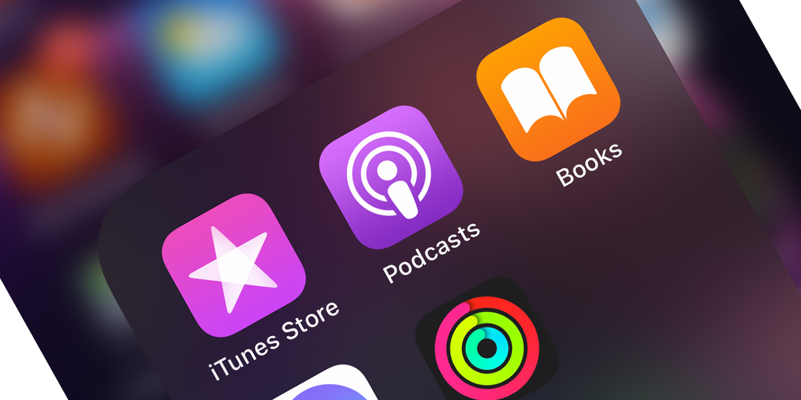

# 播客软件

首先，你需要一个播客客户端。如果是苹果手机，随系统安装的 Podcasts 已经很好用了。

如果是 Android 手机，在「[全平台播客订阅及收听指南](https://sspai.com/post/57960)」里找个合适的。

登录 [Podcast Maker](https://pcmaker.club/) 首页，每个频道都有 RSS 按钮，点击，RSS 地址即拷贝到操作系统剪贴板。

下一步，选择自己喜欢的播客软件，将拷贝到的 RSS 地址，导入到播客软件中。后文列举了几个播客软件的使用方法。
